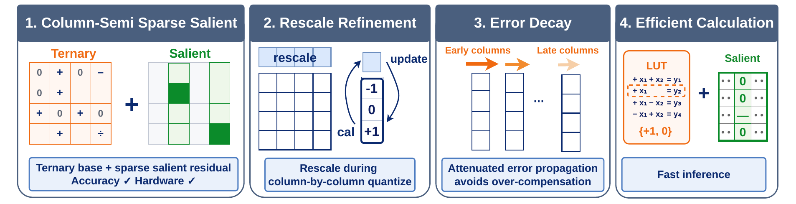
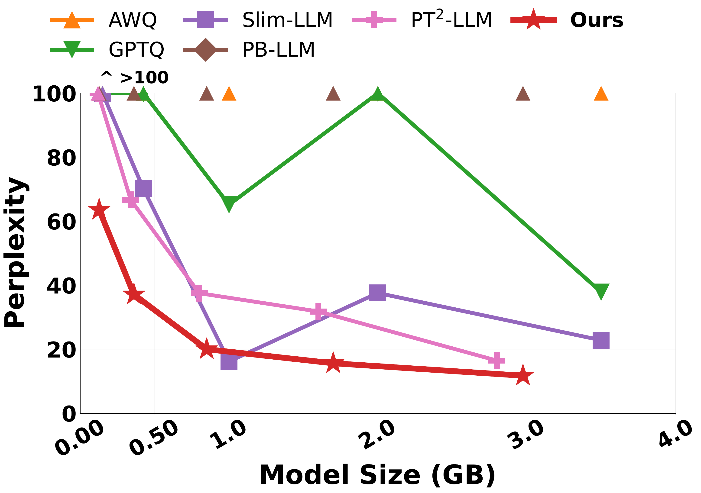

<div align="center">

# QTEA: Ternary LLMs with Sparse Residual Salient Weight and By-Column Optimization

<p>
  <a href="https://arxiv.org/abs/XXXX.XXXXX">
    
  </a>
  <a href="https://github.com/Intelligent-Microsystems-Lab/QTEA">
    
  </a>
  <a href="LICENSE">
    
  </a>
</p>

<p>
  <a href="https://coco-alen.github.io/personal-web/">Yipin Guo</a>,
  Arun M George,
  Jie Fu,
  Tareq Mahmoud,
  <a href="https://siddharth-joshi.com/">Siddharth Joshi</a>
</p>

<p>University of Notre Dame</p>

</div>

---

## News

- **2026-08-21:** QTEA is accepted to the **EMNLP 2026 Main Conference**.

---

## Abstract

QTEA is a post-training quantization method that quantizes the linear layers of
a decoder-only LLM into effectively **1.7 bits per weight** using just a single 
pass over 256 calibration sequences.

We treat salient weights as *error compensators*. QTEA first quantizes every 
weight into a compact ternary base `{-1, 0, +1}`, then spends a small residual
budget on the columns where ternarization causes the largest drop in accuracy. 
This allows for keeping one FP8 value per four rows inside those columns, 
facilitating a *column-semi sparse* layout that recovers most of the accuracy 
of unstructured salient weights while staying GPU-friendly. We also implement 
two further changes to the GPTQ-style column-by-column sweep: we use a 
per-column rescale factor that is jointly optimized with the ternary assignments,
and we introduce an error decay term that attenuates error propagation so late
columns are not over-compensated. A lookup-table CUDA kernel then evaluates the
result ensuring that the hardware can take advantage of the ternarization.

<p align="center">
  
</p>

## Highlights

**Quality.** QTEA achieves the best average zero-shot accuracy among the
methods we evaluated, with the advantage increasing with model size.

- **Qwen3-14B:** average zero-shot accuracy rises from 45.11% to **52.65%**,
  a 16.7% relative gain, with **1.40×** lower WikiText-2 perplexity 
  (16.48 → 11.78) and **2.61×** lower C4 perplexity (68.13 → 26.14).
- **Llama3-8B:** accuracy improves from 37.79% to **40.29%** (6.6% relative),
  with **1.34×** and **1.95×** lower WikiText-2 and C4 perplexity.
- The 1:4 semi-sparse residual costs only 0.9 accuracy points against an
  unstructured salient-weight upper bound, at **4× lower residual storage**.

**Efficiency.** The lookup-table kernel delivers practical speedups.

- **7.2×** faster per-token generation than FP16 with CUDA Graphs on Llama2-70B
  (41.13 → 5.70 ms/token), and **13.3×** against FP16 without CUDA Graphs;
  **3.62×** on Qwen3-14B.
- Latency matches a ternary-only kernel to within 0.01–0.03 ms/token.
- Speedup is stable at **3.07–3.20×** for batch size 1 across 512–4096 tokens of
  context, and still 2.54× at batch size 4.
- On a commercially available TSMC 22nm-based implementation, a co-designed 
  accelerator delivers **3.83×** lower latency and **69.4%** lower energy than 
  dense FP16 matrix multiplication.

<p align="center">
  
</p>

---

## Installation

```bash
conda create -n qtea python=3.12 -y
conda activate qtea
pip install -r requirements.txt
```

If you already maintain a PyTorch CUDA environment, install the packages from
`requirements.txt` there instead of creating a new one. `lm_eval` is only needed
for zero-shot accuracy, and a CUDA toolchain (`nvcc`) is only needed for the
lookup-table inference kernel.

## Quantization

To quantize a model yourself:

```bash
python quantize.py --model Qwen/Qwen3-8B-Base --output packed/qwen3-8b.pt
```

This writes a packed checkpoint holding the ternary codes, with the residuals and the
scales compressed. Only one decoder block is resident on the GPU at a time, so the 
footprint is set by the calibration activations and the largest block rather than by
the model. Lower `--nsamples` if OOM;

A QTEA-quantized **Qwen3-14B-Base** checkpoint is also published on the Hugging Face
Hub as [`ims-lab/Qwen3-14B-base-QTEA`](https://huggingface.co/ims-lab/Qwen3-14B-base-QTEA),
so you can skip this step and go straight to [Evaluation](#evaluation):

```bash
huggingface-cli download ims-lab/Qwen3-14B-base-QTEA packed_qwen3_14b.pt --local-dir packed/
```

## Evaluation

```bash
python eval/evaluate.py --model Qwen/Qwen3-8B-Base --checkpoint packed/qwen3-8b.pt
```

Reports WikiText-2 and C4 perplexity plus zero-shot accuracy on the seven tasks
above. Drop `--checkpoint` for the FP16 baseline, and add `--backend lut` to run
the packed weights through the lookup-table CUDA kernel instead of rebuilding
FP16 weights. See [`eval/README.md`](eval/README.md) for the full set of
options and for how the kernel works.

## Reproducing the Paper

```bash
bash scripts/quantize_qwen3.sh          # Qwen3-Base, 0.6B to 14B
bash scripts/quantize_llama3.sh         # Llama3-8B
```

Both scripts quantize and then evaluate, writing JSON results to `results/`. The
defaults in `quantize.py` are the values used for paper. Note that We apply an
additional ternary-fitting round for Llama3, this is captured in the script.

Reproduced here on one H200 with torch 2.8 / transformers 4.56:

| model | WikiText-2 | C4 | zero-shot avg |
| --- | --- | --- | --- |
| Qwen3-0.6B-Base | 63.58 | 172.66 | 34.37 |
| Qwen3-14B-Base | 11.78 | 26.14 | 52.67 |
| Llama3-8B | 24.09 | 66.39 | 40.13 |

Quantization is deterministic for a given GPU and library stack, but numerics
are impacted by differences between environments: the ternary assignment is a
hard threshold inside a sequential error-feedback loop, which can be impacted 
by rounding differences between hardware.

Llama-3 and Qwen3 are supported out of the box. Any decoder stack that exposes
`model.model.layers` with the usual seven projections works unchanged; other
families need their projection names added to `qtea/sequential.py`.

---

## Repository Contents

**Quantization**

- `quantize.py`: command-line entry point — quantizes one model and saves the
  packed checkpoint.
- `qtea/qtea.py`: the QTEA algorithm for a single linear layer. Sweeps the
  columns left to right, picking the salient columns, refining their rescale
  factors, fitting the sparse residual and propagating the quantization error.
- `qtea/quantizer.py`: fits the ternary scale and centre that every group of 128
  columns shares.
- `qtea/sequential.py`: applies the quantizer to the whole decoder stack, one
  block at a time, so only one block ever sits on the GPU.
- `qtea/pack.py`: the checkpoint format — packs and unpacks the ternary codes
  (five per byte), the FP8 residuals and the scales.
- `qtea/data.py`: WikiText-2 and C4 loaders for calibration and perplexity.
- `qtea/model.py`: HuggingFace model loading.

**Evaluation**

- `eval/evaluate.py`: measures perplexity and zero-shot accuracy for a packed
  checkpoint, or for the FP16 baseline.
- `eval/perplexity.py`: perplexity, computed one decoder block at a time to keep
  memory low.
- `eval/packed_linear.py`: loads a packed checkpoint into a HuggingFace model.
- `eval/ternary_kernel.py` and `eval/csrc/ternary_gemv.cu`: the lookup-table
  GEMV kernel — the Python wrapper and the CUDA source behind the paper's
  latency numbers.
- `eval/check_kernel.py`: checks the kernel against a dense FP16 matmul.

**Other**

- `scripts/`: one reproduction script per model family.
- `tests/`: round-trip tests for the checkpoint format (`python -m pytest tests`).
- `figs/`: figures used by this README and by `eval/README.md`.

## Citation

If you find QTEA useful in your research, please cite:

```bibtex

```

## License

This project is released under the MIT License. See `LICENSE` for details. The
evaluation datasets and the models retain their own licences.
