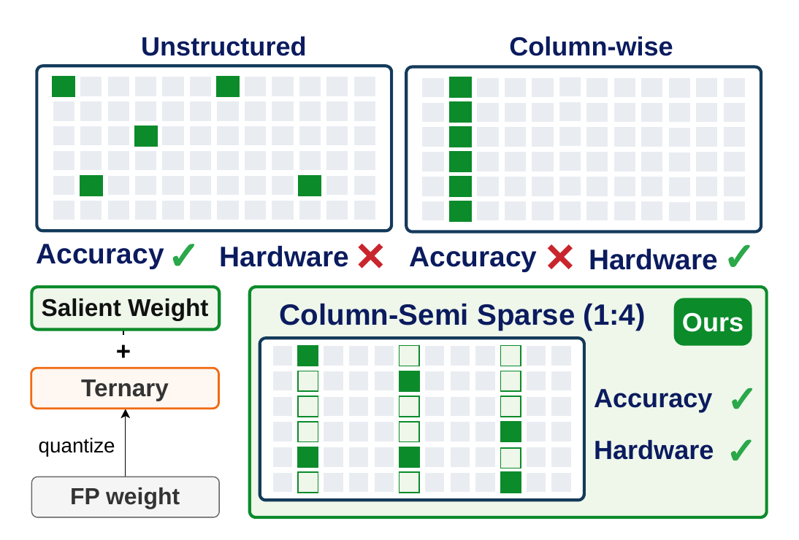

# QTEA — Quantized Ternary Error Adaptation

Reference implementation of the post-training quantization method described in
*QTEA: Ternary LLMs with Sparse Residual Salient Weight and By-Column
Optimization*.

QTEA turns the linear layers of a decoder-only LLM into ternary weights
`{-1, 0, +1}` and repairs the resulting error with a sparse FP8 residual on a
small set of salient columns. No retraining is involved: one pass over 256
calibration sequences is enough.

```
W_ij  ~=  beta_i + v_j * alpha_i * T_ij  +  R_ij        T_ij in {-1, 0, +1}
          \_______ ternary base _______/     \_ 1:4 sparse FP8 residual _/
```


Four pieces make that work at 1.7 bits. A **column-semi sparse salient**
residual repairs the ternary error where it hurts most, in a layout the
hardware can actually stream. A **rescale refinement** re-fits one scalar per
column as the sweep advances, because error propagation keeps moving the target.
**Error decay** attenuates that propagation along the block, so late columns are
not asked to absorb more than they can. And a **lookup-table kernel** evaluates
the result without ever decoding the ternary weights.

| component | cost |
| --- | --- |
| ternary codes, five per byte in base 3 | 1.600 bpw |
| FP8 residual on 5% of the columns, 1:4 sparse (8-bit value + 2-bit index) | 0.125 bpw |
| **weight payload** | **≈1.7 bpw** |
| per-column rescale `v` | 32 / `out_features` bpw |
| per-group `alpha`, `beta` (128 columns per group) | group scales, as in any group-wise quantizer |

## Install

```bash
pip install -r requirements.txt
```

`lm_eval` is only needed for zero-shot accuracy, and a CUDA toolchain (`nvcc`)
is only needed for the lookup-table inference kernel.

## Quantize

```bash
python quantize.py --model Qwen/Qwen3-8B-Base --output packed/qwen3-8b.pt
```

This writes a packed checkpoint holding the ternary codes, the residuals and the
scales — nothing is stored in full precision. Only one decoder block is resident
on the GPU at a time, so the footprint is set by the calibration activations and
the largest block rather than by the model: Qwen3-14B peaks around 15 GB and
takes about 40 minutes on one H200, Llama3-8B about 20. Lower `--nsamples` if
that does not fit; it is the dominant term.

## Evaluate

```bash
python eval/evaluate.py --model Qwen/Qwen3-8B-Base --checkpoint packed/qwen3-8b.pt
```

Reports WikiText-2 and C4 perplexity and zero-shot accuracy on PiQA, ARC-e,
ARC-c, HellaSwag, WinoGrande, OpenBookQA and BoolQ. Drop `--checkpoint` for the
FP16 baseline, and see [`eval/README.md`](eval/README.md) for the evaluation
options and the custom CUDA kernel.

## Reproducing the paper

```bash
bash scripts/quantize_qwen3.sh          # Qwen3-Base, 0.6B to 14B
bash scripts/quantize_llama3.sh         # Llama3-8B
```

Both scripts quantize and then evaluate, writing JSON results to `results/`.
The defaults in `quantize.py` are the recipe used for every number in the paper;
Llama3 is the one exception and takes an extra ternary-fitting round, which the
script passes for you.

Table 1 of the paper, restricted to the models supported here:

| model | WikiText-2 | C4 | zero-shot avg |
| --- | --- | --- | --- |
| Qwen3-0.6B-Base | 63.58 | 172.67 | 34.13 |
| Qwen3-1.7B-Base | 37.13 | 112.48 | 38.86 |
| Qwen3-4B-Base | 20.04 | 53.98 | 44.47 |
| Qwen3-8B-Base | 15.66 | 38.72 | 47.12 |
| Qwen3-14B-Base | 11.78 | 26.14 | 52.65 |
| Llama3-8B | 24.09 | 66.45 | 40.29 |


Zero-shot accuracy is the unnormalised average over the seven tasks. The paper's
numbers were produced with the same harness generation as the published
baselines, so individual task scores can move against a current `lm_eval`
release even when the average lines up.

Reproduced here on one H200 with torch 2.8 / transformers 4.56:

| model | WikiText-2 | C4 | zero-shot avg |
| --- | --- | --- | --- |
| Qwen3-0.6B-Base | 63.58 | 172.66 | 34.37 |
| Qwen3-14B-Base | 11.78 | 26.14 | 52.67 |
| Llama3-8B | 24.09 | 66.39 | 40.13 |

Quantization is deterministic for a given GPU and library stack, but it is not
robust to last-bit arithmetic differences between environments: the ternary
assignment is a hard threshold inside a sequential error-feedback loop, so a
handful of flipped codes early on can move perplexity by a percent or more.

## How it works

Quantization runs block by block. For each linear layer QTEA accumulates the
calibration Hessian `H`, then sweeps its columns left to right, quantizing one
column and propagating the resulting error into the columns that follow it —
the GPTQ schedule, with the following changes.

**Ternary base** (`qtea/quantizer.py`). Each group of 128 columns gets a
per-row level `alpha` and centre `beta`, fitted by alternating a least-squares
solve with a reassignment of the ternary codes.

**Salient columns** (`QTEA._select_salient`). Columns are scored by
`max_i (W_ij^2 * H_jj^2)` — the worst single weight in the column rather than
its average importance — and the top 5% are quantized first and carry a
residual.



Keeping salient weights unstructured is accurate but needs a full mask and does
not decode efficiently; keeping whole columns is hardware-friendly but spends
its budget on entries the ternary base already fits. QTEA keeps one FP8 value
per four rows *inside* a salient column, which lands on both.

**Column order** (`QTEA._ldl_order`). Salient columns go first, so their
residual is fitted against the untouched weights. The remaining columns follow
the pivot order of a symmetric LDL factorisation of their Hessian block, which
puts well-conditioned columns early, where the sweep still has room to
compensate.

**Column-wise rescale** (`QTEA._rescale_refine`). Error propagation shifts the
magnitude of every column that has not been quantized yet, so the group scale no
longer fits by the time the sweep arrives. A scalar `v_j` per column is re-fitted
from the non-zero ternary entries and alternated with a code reassignment. At
inference it folds into the activations, so the ternary kernel is unchanged.

**Sparse residual** (`QTEA._sparse_residual`). For a salient column the ternary
error is approximated by keeping the largest entry of every four rows in FP8.
Unlike unstructured salient weights this has a fixed, predictable layout, and
unlike a full high-precision column it spends no bits on entries the ternary
base already fits.

**Error decay** (`QTEA.quantize`). GPTQ lets early columns spread their error
over a long suffix while late columns have almost no room left. The propagated
error is damped by `exp(-lambda * curvature * i / B)` along the block, which
matters more at ternary precision than it does at 3 or 4 bits.

## Layout

```
quantize.py            command line entry point
qtea/quantizer.py      per-group ternary parameters (alpha, beta, dead zone)
qtea/gptq.py           the QTEA sweep for one linear layer
qtea/sequential.py     block-by-block driver over the decoder stack
qtea/model.py          model loading
qtea/pack.py           base-3 + sparse FP8 storage format
qtea/data.py           WikiText-2 and C4 loaders
figs/                  figures used by this README
eval/                  perplexity, zero-shot accuracy and the CUDA kernel
scripts/               one script per model family
tests/                 round-trip tests for the storage format
```

```bash
python -m pytest tests
```

Supported architectures are Llama-3 and Qwen3. Any decoder stack that exposes
`model.model.layers` with the usual seven projections works unchanged; other
families need their projection names added to `qtea/sequential.py`.

## Licence

Released under the MIT licence. The evaluation datasets and the models retain
their own licences.
