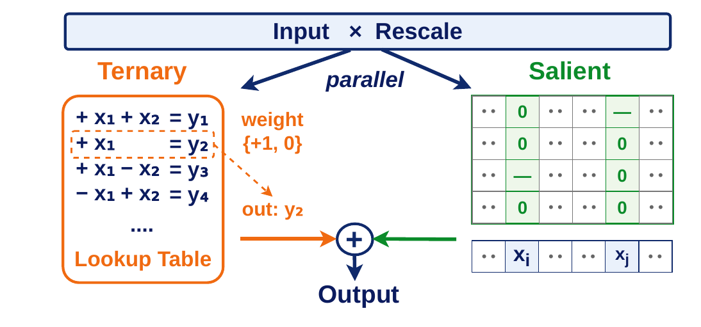

# Evaluation

Everything here works on a packed checkpoint written by `quantize.py`. Run the
commands from the repository root.

## Perplexity and zero-shot accuracy

```bash
python eval/evaluate.py --model Qwen/Qwen3-8B-Base --checkpoint packed/qwen3-8b.pt
```

| flag | default | meaning |
| --- | --- | --- |
| `--checkpoint` | — | packed checkpoint; omit it to measure the FP16 baseline |
| `--backend` | `dequant` | `dequant` rebuilds dense FP16 weights, `lut` runs the CUDA kernel |
| `--ppl` | `wikitext2,c4` | perplexity datasets, or `""` to skip |
| `--tasks` | the seven tasks of Table 1 | zero-shot tasks, or `""` to skip |
| `--limit` | — | documents per task, for a quick smoke test |
| `--batch-size` | `8` | zero-shot batch size; forced to 1 for the `lut` backend |
| `--output` | — | also write the results as JSON |

Perplexity streams one decoder block at a time, so a 14B model needs roughly the
memory of its largest block plus the activations, not of the whole network. The
zero-shot pass has no such luxury: with the `dequant` backend the whole FP16
model sits on the GPU, about 30 GB for a 14B model. `--backend lut` keeps it
packed instead and needs a fraction of that.

A fast sanity check:

```bash
python eval/evaluate.py --model Qwen/Qwen3-0.6B-Base --checkpoint packed/qwen3-0.6b.pt \
    --ppl wikitext2 --tasks piqa --limit 64
```

## Inference kernel



`--backend lut` keeps the weights packed and evaluates them with the
lookup-table CUDA kernel in `csrc/ternary_gemv.cu`, the one the latency numbers
of the paper come from. Because five ternary values fit in a byte and
`3^5 < 2^8`, the kernel precomputes the dot product of every packed pattern with
the rescaled activations `v_j * x_j` and turns the ternary product into table
lookups; sign symmetry halves the table. The sparse FP8 residual is accumulated
in the same launch, and `v_j` is folded into the table, so no separate
dequantization or rescaling pass runs.

The extension is compiled on first use and needs `nvcc` on `PATH`. It is written
for a group size of 128 and a 1:4 residual — the defaults of `quantize.py`.

To check it against dense reference math:

```bash
python eval/check_kernel.py --checkpoint packed/qwen3-8b.pt
```

The relative error should sit at the FP16 accumulation floor, around 1e-3. The
per-call times the script prints alongside it are a raw single-projection
microbenchmark, dominated by launch overhead; the end-to-end latency reported in
the paper comes from full-model generation under a captured CUDA graph, which
this script does not set up.

## Files

```
evaluate.py        command line entry point
perplexity.py      block-streamed perplexity
packed_linear.py   installs a checkpoint into a HuggingFace model
ternary_kernel.py  Python side of the lookup-table GEMV
csrc/              the CUDA kernel
```
